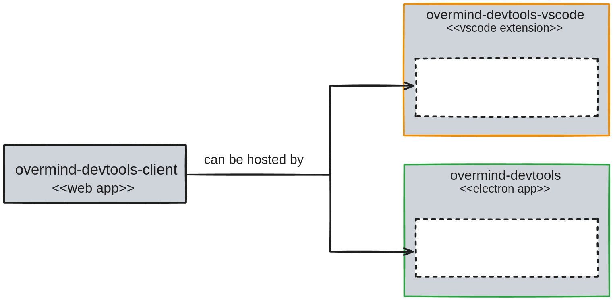

# Overmind DevTools Client

## Introduction

There are three packages related to `overmind-devtools` experience:

* [overmind-devtools-client](../overmind-devtools-client/) - "core" package that provides UI ("web client")
* [overmind-devtools](../overmind-devtools/README.md) - standalone, electron application
* [overmind-devtools-vscode](../overmind-devtools-vscode/) - VSCode extension

`overmind-devtools-client` is a core application that can be hosted by available "hosts": `overmind-devtools` and `overmind-devtools-vscode`.



This means that this package (a reminder: we're now in `overmind-devtools-client` package of the monorepo) is **crucial** for the other two.

In case you want to improve devtools experience (UI, UX, etc.), focus on this package specifically.

## Using the DevTools Web Client

### Starting the DevTools

To run the DevTools web client locally:

```bash
# Navigate to the package directory
cd overmind/packages/overmind-devtools-client

# Start both the WebSocket server and web client
npm start
```

This starts:

* The WebSocket server on port 3031 (for communication with Overmind apps)
* The web client at <http://localhost:8080> (or another port if 8080 is in use)

### Connecting Your Application

In your Overmind application, configure it to connect to the DevTools:

```javascript
import { createOvermind } from 'overmind'
import { config } from './overmind'

// Connect to the DevTools WebSocket server on port 3031
const overmind = createOvermind(config, {
  devtools: 'localhost:3031'
})
```

For default port (3031), you can simply use:

```javascript
const overmind = createOvermind(config, {
  devtools: true
})
```

### DevTools Features

The Overmind DevTools provide several powerful features:

#### 1. State Tab

* View and inspect your entire application state
* Expand/collapse nested objects and arrays
* Edit values directly in the DevTools

#### 2. Actions Tab

* See all executed actions in chronological order
* Inspect payloads, mutations, and effects for each action
* Review sequences of operations within actions

#### 3. Components Tab

* Track React components using Overmind state
* Monitor component update counts and path dependencies
* Identify performance bottlenecks from unnecessary renders

#### 4. Console Tab

* Execute actions directly from the DevTools
* Try different payloads without modifying application code

#### 5. Flushes Tab

* Track state mutations and their effects on components
* See which components updated after each state change

### Changing the Port

You can use a custom port for the WebSocket server by setting the `OV_DEV_PORT` environment variable:

```bash
# Start both the WebSocket server and web client on port 3033
OV_DEV_PORT=3033 npm start
```

This will:

1. Start the WebSocket server on port 3033
2. Configure the web client to automatically connect to port 3033

Then connect your app to that same port:

```javascript
// In your application
const overmind = createOvermind(config, {
  devtools: 'localhost:3033'
})
```

The port is displayed in the DevTools UI, under the "Devtool port" section in the runtime configuration panel.

### Troubleshooting

If you're having connection issues:

1. **Cannot connect to WebSocket server**
   * Check if the server is running (you should see "Overmind DevTools WebSocket server running on port 3031" in the console)
   * Verify no other application is using the port
   * Try specifying a different port using the OV_DEV_PORT environment variable

2. **No data appears in DevTools**
   * Ensure your Overmind app is configured with the correct devtools option
   * Check browser console for any errors
   * Make sure the port in your app configuration matches the port used by the DevTools server

3. **Components not appearing**
   * Make sure you're using the overmind-react package correctly
   * Verify components are consuming state via useAppState()

## Local Development

You can open Chrome DevTools from the application menu: Select **Application > Open Chrome DevTools**.

This package bundle (`bundle.js`) is further used by the companion "host" packages (mentioned before).

Hence, make sure you've built this package before developing the related packages.

**HINT**: you can also use the DevTools Electron app for local development by running [overmind-devtools](../overmind-devtools/README.md).
