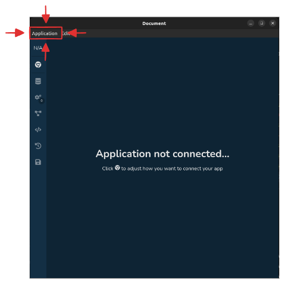

# Overmind DevTools Electron

## Introduction

This package is one of three packages related to `overmind-devtools`.

If you're looking for a little deeper insight about these, please check [overmind-devtools-client](../overmind-devtools-client/README.md).

## Usage

For normal use, you can run the DevTools directly using npx:

```sh
npx overmind-devtools
```

## Local Development

**PREREQUISITE**: Make sure you first [built](../overmind-devtools-client/README.md) the devtools UI core.

Run the development version with:

```sh
npm start
```

This will:

1. Build the DevTools electron app
2. Launch the Electron app with Chrome DevTools open for debugging

You can also open Chrome DevTools from the application menu: Select **Application > Open Chrome DevTools**.


